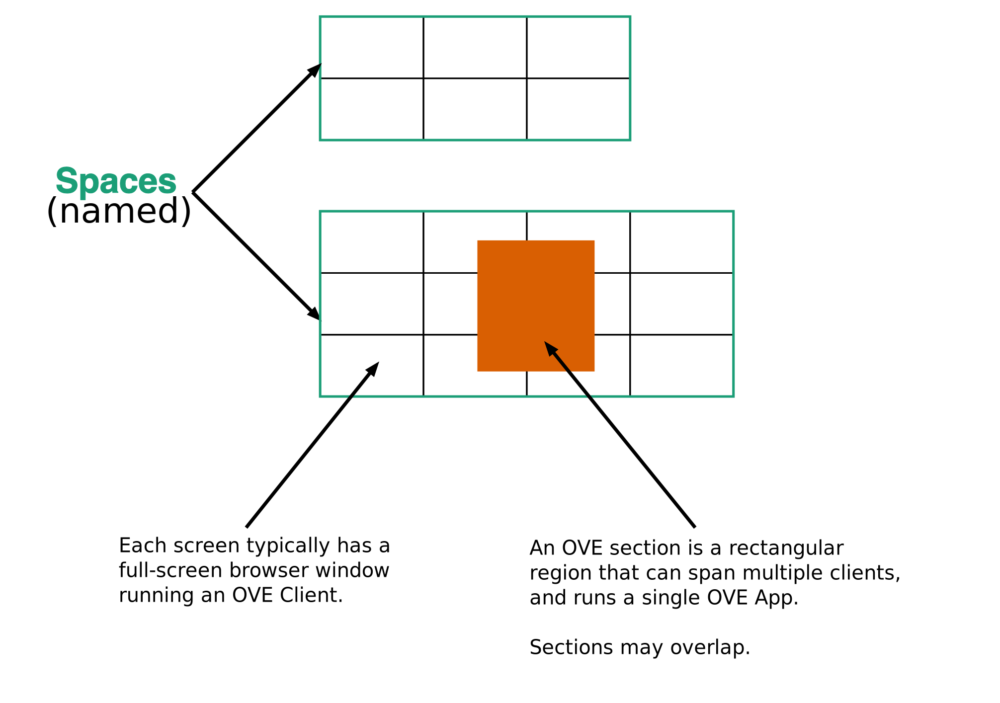
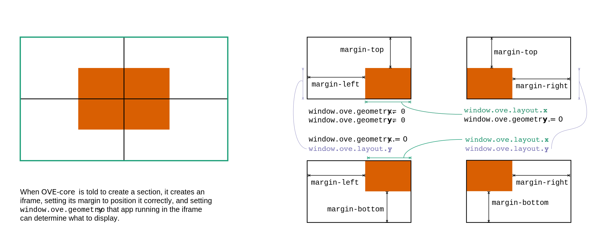

# Basic concepts

An OVE `server` installation supports multiple `spaces`. A `space` is a collection of monitors, which may be attached to different computers, that together form a single display. OVE is designed to be used in Large High Resolution Display environments; but, it is also suitable for use on much smaller displays with a single or a few monitors.

In each space, OVE runs within a number of `clients`. An OVE `client` is a browser window and typically runs full-screen on a single `screen`. A `screen` can span a single monitor or can span multiple monitors that are attached to the same computer. The arrangement of `clients` is described in the [`Spaces.json`](https://github.com/ove/ove/blob/master/packages/ove-core/src/client/Spaces.json) file. Each `client` has its own `geometry` which is a combination of its `height`, `width`, and 2D coordinates (`x`, `y`). The client's `geometry` is specified in pixels and it corresponds to the pixel dimensions of the `screen`.

Unless a `scale` property has been set, there must a one-to-one mapping between `client` pixels and `screen` pixels. The optional `scale` property can be used to specify variable `client` pixel to `screen` pixel mappings. The `scale` property accepts either one or two values, similar to the [CSS `scale()` function](https://developer.mozilla.org/en-US/docs/Web/CSS/transform-function/scale#Syntax).

An OVE `application` (or `app`) includes server-side and client-side components. Each [OVE App](https://github.com/ove/ove-apps/packages) confirm to a [common structure](./APP_DEVELOPMENT.md/#application-structure). Each of the [OVE Apps](https://github.com/ove/ove-apps) provide a way to display a distinct form of commonly used content (subject to the limitations described in the [list of pitfalls to avoid](./PITFALLS.md)).

Each individual `instance` of an OVE `app` is designed to run within its own `section`. `Sections` may span multiple `clients` and can overlap. `Sections` are rectangular regions within an `oveCanvas`. Each `section` has its own `geometry` which is a combination of its `height`, `width`, and 2D coordinates (`x`, `y`). The `geometry` describes the region on which a `section` is deployed on an `oveCanvas`. An `oveCanvas` can also have `groups` of one or more `sections` and `groups`.

Each individual OVE `app` can have its own `configuration` (or `config`) defined within a [config.json](./APP_DEVELOPMENT.md/#application-structure). The `config` is used to define named `states` other app-specific configuration, which are common to all app `instances`. Each individual `instance` of an OVE `app` can have its own `state` (which can be accessed using APIs exposed by each `app`).

Each OVE `section` does not have a background colour, and a wide majority of the apps have transparent backgrounds making it possible to overlay content from one app above another. This for example, makes it possible to use the [HTML App](https://github.com/ove/ove-apps/tree/master/packages/ove-app-html) to display a legend for a chart or a network. All OVE apps also accept an `opacity` property (at creation time or when updated), making it possible to control the opacity of overlapping content.

## Runtime environment

Each OVE `client` displays the *view* page of OVE core. When a `section` is created, a corresponding [`iframe`](https://developer.mozilla.org/en-US/docs/Web/HTML/Element/iframe) is created within each `client` that it is associated with. The *view* of the corresponding `app` is loaded into this `iframe`.

In addition to these *views*, `apps` may present a *control* page that can be accessed directly through a web browser; this controller can communicate with the *views* running in `clients` using [WebSockets](https://developer.mozilla.org/en-US/docs/Web/API/WebSockets_API).

When the `iframe` representing a `section` is created, its `margin` CSS property is used to position it correctly, and the `window.ove.geometry` object is set so that each `instance` of an `app` running within each `iframe` can determine what to display.

## Communication between components

In these diagrams, requests labelled `GET` and `POST` are HTTP requests; other messages are sent using [WebSockets](https://developer.mozilla.org/en-US/docs/Web/API/WebSockets_API).

### Managing sections

### Managing state

### High availability of server-side application components

OVE provides a [Persistence Service](https://github.com/ove/ove-services/tree/master/packages/ove-service-persistence-inmemory) which can be used to replicate server-side state among peers. This service can be registered with OVE core or any OVE application as explained in the [documentation](https://github.com/ove/ove-services/blob/master/packages/ove-service-persistence-inmemory/README.md). OVE core also accepts registration of `peer` nodes using the `http://OVE_CORE_HOST:PORT/peers` API method. Once registered OVE peers will cross-post messages that are broadcasted using WebSockets.
